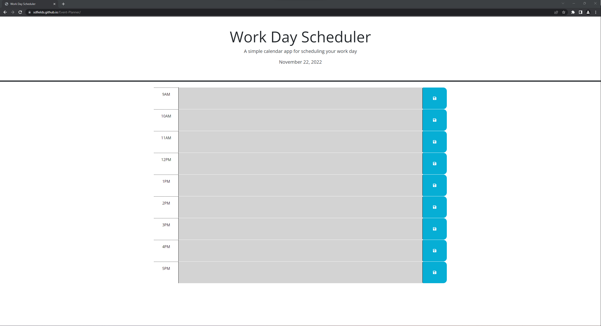

# Event Planner

# Description
The Event Planner application will allow you to create and alter a schedule for a standard 9-5 workday.

# Goal
The goal is to provide a simple but effective means of tracking your plans for the day with the assistance of color coding to help keep track of time, saved local storage to help remember your goals, and a date tracker to stay up to date.

# Use
Select a time block between 9AM and 5PM and insert your plan for that hour - this information will be saved and retained if you refresh the browser.

# Links
GitHub: https://github.com/sdfields/Event-Planner  
URL: https://sdfields.github.io/Event-Planner/

# License
MIT License

# Screenshot

